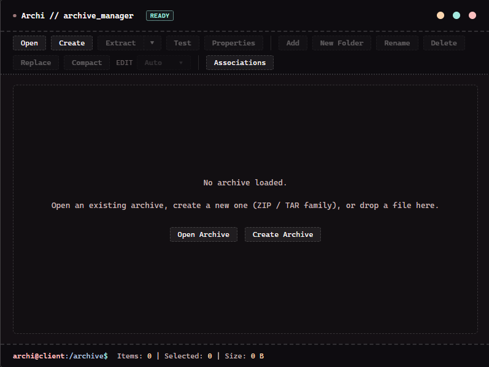
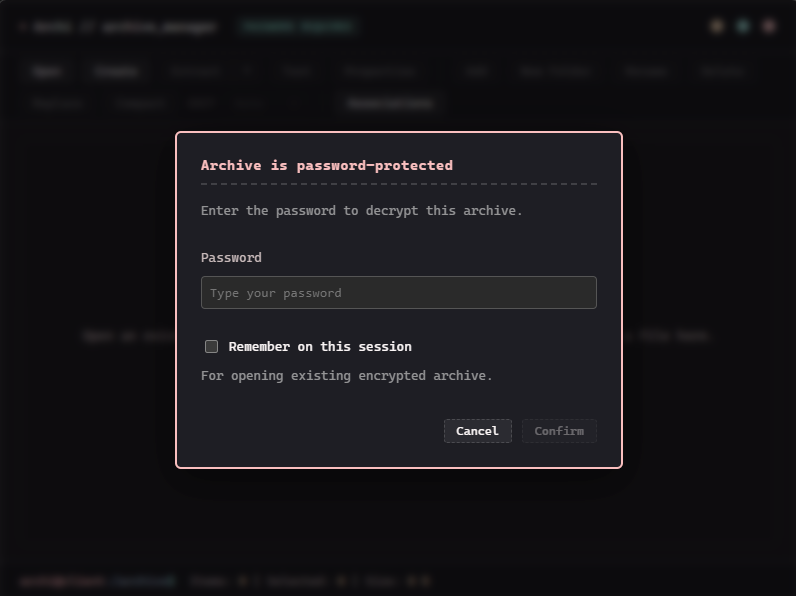
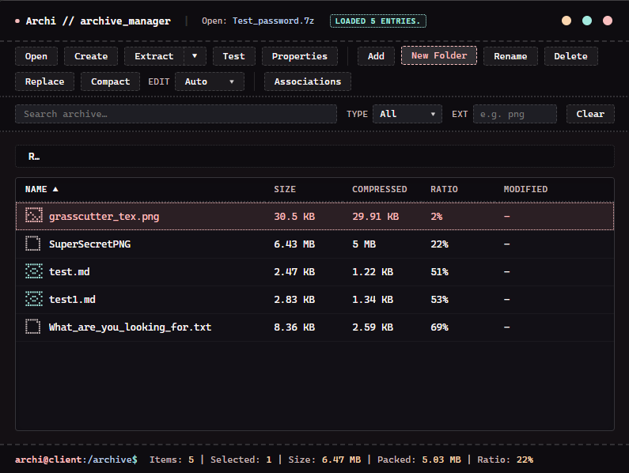

# Archi

**Windows archive manager** — open, browse, extract, create, test, and edit archives with a focus on **safe extraction** and a modern desktop UI.

Built with [Tauri 2](https://v2.tauri.app/) (Rust backend) and [Svelte 5](https://svelte.dev/).

[](https://github.com/IkEr0228/Archi/actions/workflows/ci.yml)

## Screenshots

| Main window | Create archive (with password) | Password prompt |
| --- | --- | --- |
|  |  |  |

## Features

- **Multi-format open/list/extract:** ZIP, RAR (RAR4 & RAR5), TAR, TAR.GZ, GZIP, TAR.BZ2, BZIP2, TAR.XZ, XZ, 7z
- **Encrypted archives:** open, extract, test, and create **AES-256** password-protected ZIP and 7z; password-protected RAR extraction; interactive password modal with session reuse
- **High-performance engine:** powered by `mimalloc` global allocator, hardware-accelerated `ahash` indexing, and optimized IPC serialization
- **Create:** ZIP, TAR family, and 7z (LZMA2), with shared compression presets; TAR family + password produces a real AES-256 `.7z`
- **Fast incremental edit:** ZIP in-place append + fast logical delete; 7z non-solid **pack-copy** (no full Max recompression); TAR stream rebuild
- **In-archive reorganization:** drag entries into internal folders, parent breadcrumbs, or root (`Move`) with instant in-memory preview
- **Drag & Drop extraction:** drag files and folders directly out of the archive into Windows Explorer, Desktop, or external apps (with transparent password decryption, speculative background pre-staging, and automatic temp cleanup)
- **Explorer drop & integration:** drop files from Explorer into an open archive folder, drop archives to open, or drop multiple sources to create
- **Test:** all open formats (ZIP, 7z, TAR family, single streams) — decompress/read integrity verification without writing user files
- **Browse UX:** virtual folders, whole-archive search, type/extension filters, column sorting, virtualized table rendering
- **Safe extract:** path validation, no archive symlink extract, no reparse traversal, Windows handle-relative writes
- **Conflicts:** overwrite / skip / rename / cancel (+ apply to all)
- **CLI + single-instance:** `archi.exe path\to\archive` opens in the running app
- **Opt-in Explorer associations:** per-user (HKCU only) registration for all supported archive extensions

## Format support

| Format | Open / list | Extract | Create | Test | Edit | Encryption | Notes |
| --- | --- | --- | --- | --- | --- | --- | --- |
| **ZIP** | Yes | Yes | Yes | Yes | Yes | AES-256 | Stored + Deflate. Encrypted listing works without password; extract/test prompt. Fast append add, logical delete, stream rebuild rename/move. |
| **7z** | Yes | Yes | Yes | Yes | Yes | AES-256 | LZMA/LZMA2. Password prompt on open when headers are encrypted. Non-solid pack-copy (fast delete/move/replace without recompression), encryption preserved. |
| **RAR** | Yes | Yes | No | No | No | Password | RAR4 and RAR5 formats via static `unrar` library (RARLAB source). Read and extract only (open-source license compliant). Password-protected archives supported. |
| **TAR** | Yes | Yes | Yes | Yes | Yes | via .7z | Create = store. Edit = stream rebuild. Password request creates AES-256 7z instead. |
| **TAR.GZ / TGZ** | Yes | Yes | Yes | Yes | Yes | via .7z | Edit = stream rebuild (outer recompress). Password request creates AES-256 7z instead. |
| **TAR.BZ2 / TBZ2** | Yes | Yes | Yes | Yes | Yes | via .7z | Edit = stream rebuild (outer recompress). Password request creates AES-256 7z instead. |
| **TAR.XZ / TXZ** | Yes | Yes | Yes | Yes | Yes | via .7z | Edit = stream rebuild (outer recompress). Password request creates AES-256 7z instead. |
| **GZIP** (single) | Yes | Yes | No | Yes | No | No | Integrity stream test only. |
| **BZIP2** (single) | Yes | Yes | No | Yes | No | No | Integrity stream test only. |
| **XZ** (single) | Yes | Yes | No | Yes | No | No | Integrity stream test only. |

Capability flags from the backend dynamically drive the UI: unavailable actions stay disabled.

## Password-protected archives

- **Open/list:** encrypted 7z prompts immediately (headers are encrypted); encrypted ZIP lists entries (central directory is plaintext) and flags a warning; password-protected RAR lists headers and prompts when extraction is requested.
- **Extract / test:** password prompt with **invalid password → try again**; a correct password is automatically reused for the session (extract, test, edit, drag-out).
- **Create:** optional password field in the Create dialog — AES-256 for ZIP and 7z. For TAR-family formats there is no native encryption, so Archi warns and writes a real `.7z`.
- **Edit on encrypted 7z:** add/rename/delete/move/replace/compact keep the archive encrypted with the same session password.

## Drag & drop operations

### Dragging out of Archi
- Select one or more files/folders in the archive table.
- Drag directly into **Windows Explorer**, onto the **Desktop**, or into applications (Notepad, web browsers, Discord, etc.).
- Utilizes native Windows OLE `CF_HDROP` integration with real embedded drag icons and speculative pre-staging on `pointerdown` for minimal latency.
- Staged temporary files are automatically cleaned up in the background once external applications finish reading them.

### Dragging into Archi
| Drop Target | Action |
| --- | --- |
| Exactly one archive path (no archive open) | Open that archive |
| Files/folders while an **editable** archive is open | **Add into the current virtual folder** (breadcrumb path) |
| Files/folders over internal folder rows or breadcrumbs | **Move entries into that target folder** |
| Files/folders with no archive open | Open Create dialog with those paths as sources |

## Safety highlights

- Entry paths checked for traversal, absolute/drive/UNC forms, and unsafe Windows device names (`CON`, `NUL`, `AUX`, etc.)
- Archive symlinks rejected; filesystem reparse points not followed on extract/create sources
- Extracted files are **never** executed or opened automatically
- Create rejects output paths that are a source or lie inside a selected source tree
- Long operations use operation IDs, cancellable progress, and automatic cleanup of partial output
- Open-time risk assessment can gate extract behind an explicit **Continue** on suspicious metadata (zip bomb detection, extreme path depth)

## Requirements

- **Windows** 10/11 x64 (primary target)
- For building from source: Node.js 20+, Rust stable (MSVC), VS C++ build tools, [Tauri 2 prerequisites](https://v2.tauri.app/start/prerequisites/)

## Build from source

```powershell
git clone https://github.com/IkEr0228/Archi.git
cd Archi
npm install
npm run tauri dev      # development
npm run tauri build    # release + NSIS installer
```

Release artifacts (after `npm run tauri build`):

| Artifact | Typical path |
| --- | --- |
| Portable EXE | `src-tauri/target/release/archi_backend.exe` (renamed to `archi.exe` in releases) |
| Installer | `src-tauri/target/release/bundle/nsis/archi_0.3.0_x64-setup.exe` |

## Development checks

```powershell
npm run test:frontend
npm run check
npm run build
cargo fmt --manifest-path src-tauri/Cargo.toml -- --check
cargo test --manifest-path src-tauri/Cargo.toml
```

More detail: [`CONTRIBUTING.md`](CONTRIBUTING.md). Living status: [`docs/STATUS.md`](docs/STATUS.md).

## Command-line

```text
archi.exe path\to\archive.zip
```

Relative paths resolve against the process working directory. Archi is **single-instance**: a second launch forwards the path to the first process and exits.

## Extract conflict policy

When a destination **file already exists**:

| Choice | Behavior |
| --- | --- |
| **Overwrite** | Replace the regular file via secure temp + rename |
| **Skip** | Leave existing; count as skipped |
| **Rename** | Write as `stem (n).ext` |
| **Cancel** | Stop and clean partials |
| **Apply to all** | Remember Overwrite/Skip/Rename for this operation only |

Hard fails (no modal): destination symlink/reparse, file↔directory conflicts, duplicate plan destinations.

## Create archive options

| Option | Default | Behavior |
| --- | --- | --- |
| **Format** | ZIP (picker) | ZIP, TAR family, 7z |
| **Compression** | Normal | Store / Fast / Normal / Max (mapped per codec) |
| **Include root folder** | On | Directory sources keep their folder name at archive root |
| **Overwrite if exists** | Off | On: replace existing **regular file** only |

## Edit archive

- **ZIP:** fast append for new files, logical delete (marks deleted in central directory without rewriting), or full compact rebuild when requested.
- **7z:** non-solid **pack-copy** (extracts and copies compressed pack streams directly, saving full recompression time); stream rebuild fallback for solid archives.
- **TAR family:** stream rebuild without requiring a full unpacked temporary directory tree.
- **RAR & Single-stream GZIP/BZIP2/XZ:** in-archive editing is disabled by design.

| Action | Behavior |
| --- | --- |
| **Add** | Files/folders under current virtual folder |
| **New Folder** | Empty directory entry |
| **Rename** | File or folder (prefix rewrite for folders) |
| **Delete** | Selection + recursive folder prefix |
| **Replace** | One file’s content from disk |
| **Move** | Drag and drop entry into any internal folder or breadcrumbs |

## File associations (opt-in)

Toolbar **Associations** registers Archi under **HKCU** only (not machine-wide, not installer-default). Reversible from the same dialog. Supports `.zip`, `.7z`, `.rar`, `.tar`, `.gz`, `.bz2`, `.xz`, and compound extensions.

## Limitations

- RAR creation/compression is disabled to adhere strictly to open-source licensing rules (reading and extraction are fully supported)
- ZIP methods beyond Stored/Deflate are not decompressed
- TAR-family formats have no native encryption — password-protected create falls back to 7z
- Secure extract path is Windows-focused (utilizing native NTFS handle-relative writes)

## Documentation map

| Doc | Purpose |
| --- | --- |
| [`docs/STATUS.md`](docs/STATUS.md) | Phase / status snapshot |
| [`docs/architecture/`](docs/architecture/) | Roadmap / architecture |
| [`docs/DEVELOPMENT.md`](docs/DEVELOPMENT.md) | Coding and security conventions |
| [`SECURITY.md`](SECURITY.md) | Vulnerability reporting |
| [`CONTRIBUTING.md`](CONTRIBUTING.md) | How to contribute |

## License

[MIT](LICENSE) © 2026 [IKER](https://github.com/IkEr0228)

Third-party crates and npm packages remain under their own licenses (see `Cargo.lock` / `package-lock.json`).
